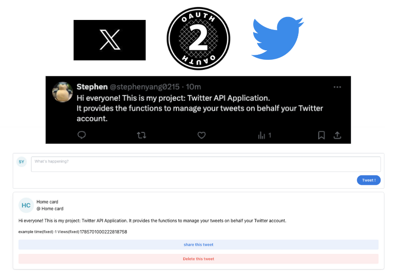
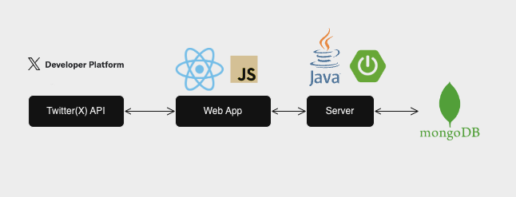

# Twitter API Application

### Project Description:
This is the project for CS622 Advanced Programming Techniques which aims to utilize Java's functionality to work with Twitter's (X) API. We'll demonstrate the skills of Java's technologies to post, search for tweets, and look up a user. Apart from covering the basic functionality of this application, it adheres to the fundamental principles of software development to ensure consistency, efficiency, and robustness. 
### Key Features
The app covers the basic functionalities of Twitter(X) which allows users to easily access to retrieve, manage, and monitor activities through the Twitter (X) API.

### Java Technologies Utilized:
- Object Serialization 
  In Twitter(X) API, many objects are served as JSON, including Tweets and Users. In order to work this project within the Java environment, the JSONs it receives through the API have to be deserialized to JAVA objects.
- Generic Collections 
  Generic Collections can be used to manage, manipulate, and store data safely in this project. Since it can catch type issues at compile time, generic collection can be used for storing API data that is fetched from Twitter. And store the data like tweets and users in type-safe collections. Also, by using generic collections, we can easily mapping the data or filtering the data.
- Lambda coding 
  To filter and get the information as required we use lambda expression and stream API for filtering the database with the keyword that was taken in in form of JSON string. Not just to retrieve the information but also can be used to store the information in the database with the corresponding data.
- Json handling 
  We can use JSON to store user information, the posts that the users have posted on the app, and whatever the user submits something to the app we can store that and put it into our database. It can be used for when a user wants to search something it submits the keyword as JSON string to match and see if there is such information in the database. JSON can be represented as objects and array types which would help us store the information in the database or display the information more easily and better for us to read. We can use JSON objects to have string values of the user’s first name, last name, username, and other information, and use a JSON array of user post objects.

By adding JSON.simple a simple Java library that allows parsing, generating, transforming, and querying JSON. It’s a Java API for JSON processing.
- Database access in Java 
  To persist the objects we receive through the API, it comes up with the option for a database. In this case, we opt for MongoDB which provides NoSQL functionality that allows to storage of unstructured data such as text and images.
### Other Technologies Utilized:
- Database: MongoDB
- Container: Docker
- API Framework: SpringBoot
- Front-End: React, Javascript

### Material:
[Software User Documentation](https://github.com/stephenyang0215/CS622-Advanced-Programming-Techniques/blob/main/Software_User_Documentation.pdf)
### Resources:
[Twitter API Client Library for Java](https://github.com/xdevplatform/twitter-api-java-sdk)
